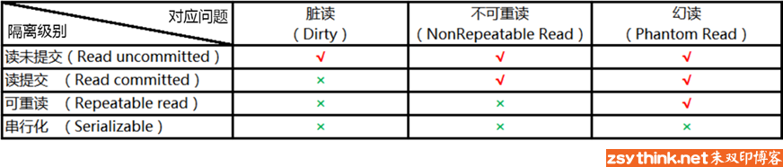

1.事务级别
```sh
事务的隔离级别分为：
    未提交读(read uncommitted)
    已提交读(read committed)
    可重复读(repeatable read)
    串行化(serializable)

未提交读
A事务已执行，但未提交；B事务查询到A事务的更新后数据；A事务回滚；---出现脏数据

已提交读
A事务执行更新；B事务查询；A事务又执行更新；B事务再次查询时，前后两次数据不一致；---不可重复读

可重复读
A事务无论执行多少次，只要不提交，B事务查询值都不变；B事务仅查询B事务开始时那一瞬间的数据快照；
```

2.设置事务级别
```sh
set session transaction isolation level read uncommitted;

set session transaction isolation level read committed;

set session transaction isolation level repeatable read;

set session transaction isolation level serializable;
```

3.查询事务级别
```mysql
select @@tx_isolation;

select @@transaction_isolation;

show variables like 'transaction_isolation';
```



[参考文档](https://jingyan.baidu.com/article/f25ef254891845482c1b8215.html)  
[参考文档](https://www.cnblogs.com/huasky/p/11190086.html)  
[参考文档](https://www.cnblogs.com/lxmajs/p/10277901.html)  
[参考文档](http://www.zsythink.net/archives/1233/)  


### Sequelize 执行事务
[参考文档](https://segmentfault.com/a/1190000011583945)  
[参考文档](https://blog.csdn.net/qq_42112846/article/details/83217130)  
[参考文档](https://blog.csdn.net/weixin_33721344/article/details/91412312)  
[参考文档](https://github.com/demopark/sequelize-docs-Zh-CN)  